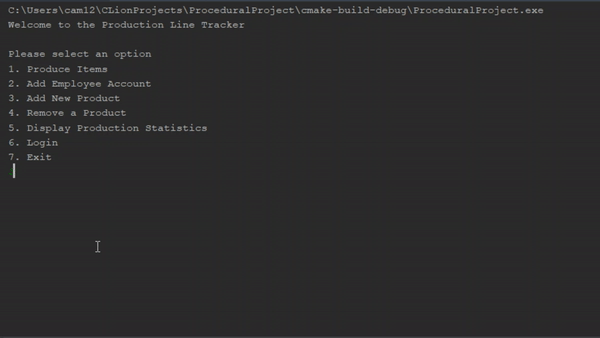

# Procedural Project

This is a project that I did for my Programming methodologies class. The goal of the project was to create software the could be used by a fictional production facility that makes media players. This software would be primarily used to track the products that are produced and store that information. Other features of this software are the ability to add and remove products that can be produced, add employee accounts, log into accounts, and see various information about what has been produced. This project was made in my sophomore year as an FGCU student studying software engineering. This was made over a 6 week long summer course and is my first time using C++. This project was made in the procedural style to learn the concepts of procedural programing.

## Demonstration

This animation shows a few of the features of my program being used. It shows the ability to add new products, produce products, and view information about the products produced. There are many other features of the program 
 

## Documentation

The program was documented using Doxygen style comments, as they are the standard for C++. Documentation can be seen at:  
https://brien17.github.io/ProceduralProject/html/main_8cpp.html

## Getting started

The easiest way to see this program running is to run it at my repl available here: https://repl.it/@cbrien17/ProceduralProject 

## Built With

* Clion 
* Doxygen
* C++
* Hard Work
* stackoverflow.com

## Contributing

I am not currently seeking any contributions to this project, but feel free to download it and use or modify it as you like.

## License 

This software is licensed under the GNU general public license and is free to be modified or used as desired. 

## Acknowledgments

* Professor Vanselow
* Cave of programming
* cplusplus.com
* stackoverflow.com

## Key Programming Concepts Utilized

The main learning goal of this program was to understand more about procedural programming, by making a program that did not utilize any classes. Procedural programming is very different from object-oriented programing (OOP) because you have to use functions to accomplish everything that you want to do instead of objects. As a result, procedural design is a top-down approach instead of OOP's bottom-up approach. 

